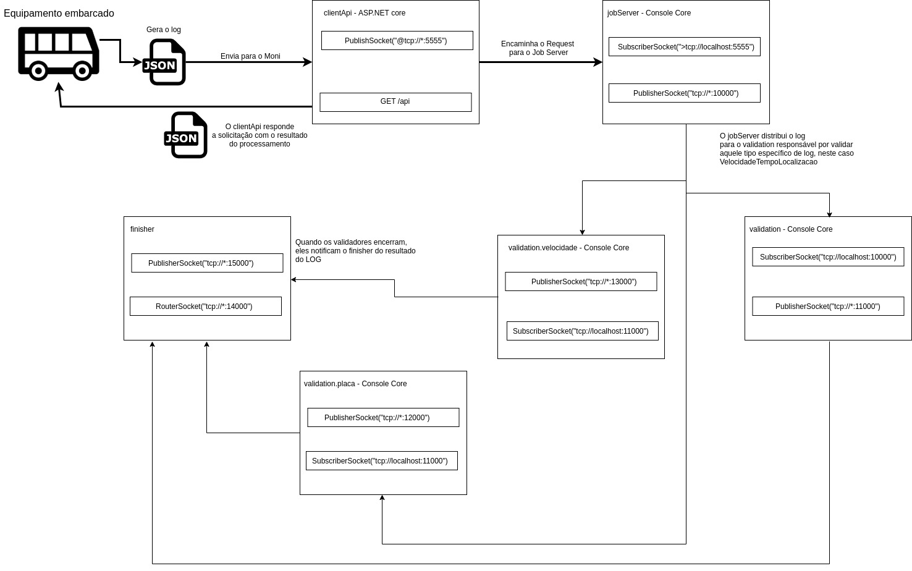

# Moni Zmq

Este é um projeto de exemplo, demonstrando o uso de sockets como infraestrutura de comunicação e distribuição de processamento.
Os sockets são criados utilizando a library netmq, que é o client C# do zeromq.

Trata-se de um cenário real, construido a partir de documentação oficial disponível no site da ANTT, no link: http://www.antt.gov.br/passageiros/MONITRIIP.html

# Problema

As empresas de transporte rodoviário em todo país precisam enviar, continuamente, logs com registros de diversas operações.
Entre estes logs está o método embarcado de VelocidadeTempoLocalizacao.

Chama-se de método "embercado" pois os dados são originários do carro (ônibus) a partir de uma central que capta dados do veículo, como velocidade atual, velocidade média, latitude, longitude dentre outros.
Todas as empresas precisam fazer o envio dos dados em um intervalo de 30 a 60 segundos.

Cada log é validado, e a resposta do envio fica disponível para a transportadora com dados de sucesso, ou com erros que são levantados de acordo com validações estabelecidas na resolução da ** ANTT ** N° 4.499/14.

# Desenho



# Run

A solução é composta por uma web api, responsável por ser o ponto de envio dos logs por meio das empresas de transporte rodoviário, e por um conjunto de agentes cada um com uma responsábilidade específica.
Ao todo temos 5 serviços (incluindo a web api), que são:

* clientApi
* jobServer
* validation
* validation.placa
* validation.velocidade

Para executar os 4 agentes (jobServer, validation, validation.placa e validation.velocidade) basta entrar na pasta de cada projeto e executar:

```
dotnet run --project /$PATH/monitriipTdc/validators/validation/validation.csproj
dotnet run --project /$PATH/monitriipTdc/validators/validation.placa/validation.placa.csproj
dotnet run --project /$PATH/monitriipTdc/validators/validation.velocidade/validation.velocidade.csproj
dotnet run --project /$PATH/monitriipTdc/server/jobServer/jobServer.csproj
```

Substitua $PATH pelo caminho onde você fez o download da aplicação. Não importa a ordem.

O clientApi utiliza o Asp.net Core v3.0.101, para se gerar uma release basta entrar no diretório do clientApi e executar o comando:

```
dotnet publish -c Release
```

Em seguida, basta copiar os arquivos para a sua estrutura (seja com nginx ou apenas o kestrel) e executar:

```
dotnet clientApi.dll
```

O log de VelocidadeTempoLocalizacao é um json no seguinte formato:

```
{
	"idLog": int,
	"cnpjEmpresaTransporte": string,
	"placaVeiculo": string,
	"velocidadeAtual": int,
	"distanciaPercorrida": int,
	"situacaoIgnicaoMotor": int,
	"situacaoPortaVeiculo": int,
	"latitude": decimal,
	"longitude": decimal,
	"pdop": decimal,
	"dataHoraEvento": yyyyMMdd
	"smalldatetime": yyyyMMdd
}
```

Exemplo:

```
{
	"idLog": 1,
	"cnpjEmpresaTransporte": "42467460000174",
	"placaVeiculo": "MAA1111",
	"velocidadeAtual": 80,
	"distanciaPercorrida": 100,
	"situacaoIgnicaoMotor": 1,
	"situacaoPortaVeiculo": 1,
	"latitude": -19.513198,
	"longitude": -47.313823,
	"pdop": -47.313823,
	"dataHoraEvento": "20191109",
	"smalldatetime": "20191109"
}
```

Com a aplicação em execução, basta enviar um POST para o entry point /api/log/

#Usando docker
O repositório acompanha os arquivos dockerfile e compose para toda solução.
Com ambas as ferramentas instaladas (docker e docker-compose) acesse o diretório monitriipTdc e execute:

```
#sudo docker-compose build
#sudo docker-compose up
```

Os comandos acima realizam o build das imagens, fazendo download e preparando para execução, e na sequência a solução fica online.

# Stack

Asp.Net Core v3.0.101
Netmq 
Redis
Docker
Ubuntu 19.10 (principal host, windows ready)

